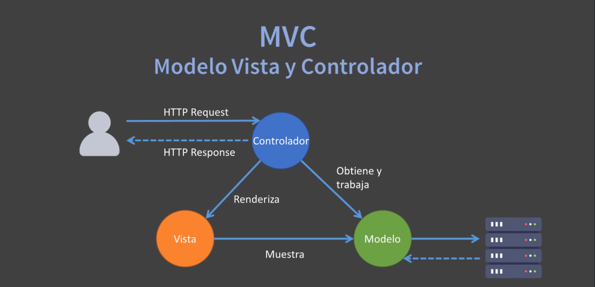

# ¿QUÉ ES SPRING MVC?

Un framework web basado en MVC, toma ventajas de los siguientes principios.

* Modelo, Vista y Controlador.
* Inyección de Dependencias.
* Orientado al uso de Interfaces.
* Uso de clases POJO.

Spring MVC es parte, es un componente del ecosistema de Spring Framework, solamente, porque también dentro de Spring Framework tenemos todo lo que es Inyección de Dependencias.

Mucho mas allá de un patrón de diseño, Spring MVC es un patrón de arquitectura, puesto que internamente engloba varios patrones de diseño,, es decir, está formado por varios patrones de diseño, no solamente uno, es un patrón de arquitectura.

# ¿CÓMO FUNCIONA SPRING?

1. El FrontController DispatcherServlet recibe una solicitud HTTP del navegador.

2. Luego aplica un controlador basado en la URL (Handler mapping) y asinga el request al controlador.

3. El controlador se relaciona con componentes de la lógica de negocio y envía datos a la vista usando el objeto Model.

4. El controlador retorna/asigna el nombre de la vista lógica a mostrar.

5. Se selecciona un ViewResolver, el cuál aplica un determinado tipo de vista (HTML, PDF, Excel, ect.)

6. Finalmente la vista es mostrada al cliente usando los datos del objeto Model.

# ¿QUÉ HACE UN CONTROLADOR?

Los controladores proporcionan acceso a la lógica de negocio Delega la lógica de negocio a un conjunto de componentes de servicios.

Los servicios a su vez acceden a las Bases de Datos mediante la interfaz DAO (Objeto de Acceso a Datos).

Los controladores reciben parámetros del usuario (input) y lo convierte en un objeto del modelo, poblando en su atributos los datos enviados, como resultado de la lógica de negocio.